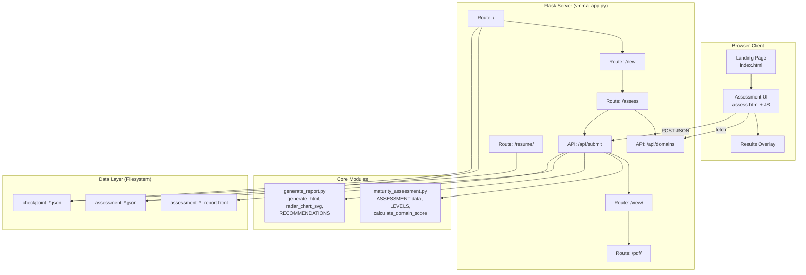
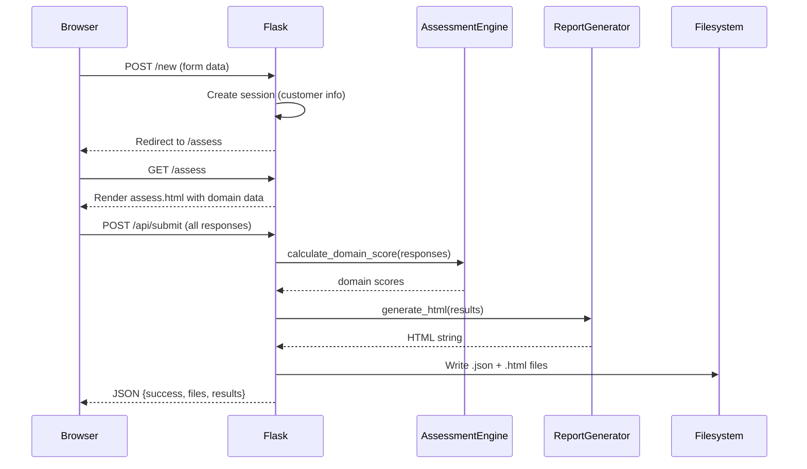

# Design Document: VMMA Web Application

## Overview

The Vulnerability Management Maturity Assessment (VMMA) application is a Flask-based web application that replaces a CLI questionnaire with an interactive browser interface. It enables assessors to evaluate an organization's vulnerability management program maturity across 10 control domains, calculate weighted maturity scores on a 1–6 scale, and generate professional HTML reports with radar charts, gap analysis, and prioritized recommendations.

The system follows a server-rendered architecture with a lightweight JSON API for dynamic interactions. Assessment data is persisted as JSON files on the local filesystem, making it portable and simple to deploy without database dependencies.

### Key Design Decisions

1. **Flask with server-side rendering + client-side interactivity**: Jinja2 templates handle initial page rendering while JavaScript manages the in-page questionnaire experience (domain navigation, bulk actions, progress tracking).
2. **File-based persistence over database**: JSON files provide portability and simplicity for single-assessor deployments. Future requirements (14) plan a database migration path.
3. **Session-based state management**: Flask sessions track in-progress assessment state, with checkpoint files providing cross-session persistence.
4. **Self-contained report generation**: HTML reports are generated as standalone files with inline SVG charts and CSS — no external dependencies required for viewing or printing.

## Architecture



### Request Flow



## Components and Interfaces

### 1. Flask Application (`vmma_app.py`)

The central web server component providing routes and API endpoints.

**Routes (Page Rendering):**

| Route | Method | Purpose |
|-------|--------|---------|
| `/` | GET | Landing page with new assessment form and existing assessment/checkpoint lists |
| `/new` | POST | Create session from form data, redirect to assessment |
| `/assess` | GET | Render the interactive questionnaire SPA |
| `/resume/<filename>` | GET | Restore session from checkpoint, redirect to assessment |
| `/view/<filename>` | GET | Render stored assessment as HTML report |
| `/pdf/<filename>` | GET | Render print-optimized report with auto-print script |

**API Endpoints (JSON):**

| Endpoint | Method | Input | Output |
|----------|--------|-------|--------|
| `/api/domains` | GET | — | Full domain/question data as JSON |
| `/api/submit` | POST | `{customer, domains: {name: [responses]}}` | `{success, json_file, report_file, results}` |
| `/api/report/<filename>` | GET | — | Raw HTML report content |

**Session State:**
- `customer`: dict with name, industry, assessor, date
- `completed_domains`: dict of domain → {score, level, responses}
- `current_domain_idx`: integer index for navigation state

### 2. Assessment Engine (`maturity_assessment.py`)

Provides assessment data definitions and scoring logic.

**Exported Constants:**
- `ASSESSMENT`: OrderedDict of 10 domains, each containing `description` (str) and `questions` (list of `{q, level, weight}`)
- `LEVELS`: Dict mapping integer scores 1–6 to level names

**Exported Functions:**
- `calculate_domain_score(responses: list[dict]) -> int`: Computes a domain maturity score (1–6) from a list of response dicts
- `save_checkpoint(...)`: Persists in-progress state to JSON
- `load_checkpoint(...)`: Restores state from checkpoint JSON

**Scoring Algorithm:**
```
total_weight = sum(r.weight for r in responses where r.answer != 'u')
earned = sum(r.weight for r in responses where r.answer == 'y') +
         sum(r.weight * 0.5 for r in responses where r.answer == 'p')
percentage = earned / total_weight

Score mapping:
  >= 90% → 6 (Innovating)
  >= 75% → 5 (Predictable)
  >= 60% → 4 (Standardized)
  >= 40% → 3 (Managed)
  >= 20% → 2 (Initial)
  <  20% → 1 (Preliminary)
```

### 3. Report Generator (`generate_report.py`)

Produces self-contained HTML reports from assessment result data.

**Exported Functions:**
- `generate_html(data: dict) -> str`: Produces complete HTML document string from assessment results
- `radar_chart_svg(domain_scores: dict) -> str`: Generates SVG radar chart markup

**Exported Constants:**
- `RECOMMENDATIONS`: Dict mapping domain names to lists of improvement recommendation strings
- `LEVELS`, `LEVEL_COLORS`: Score-to-label and score-to-color mappings

**Report Sections Generated:**
1. Header with customer metadata
2. Overall maturity score card (score, level, recommended target)
3. Radar chart (SVG, 10-axis spider plot scaled 1–6)
4. Domain scores table (name, bar, level badge, yes/total count)
5. Gap analysis (questions answered No or Partial, grouped by domain, sorted lowest-first)
6. Prioritized recommendations (domain-specific, ordered lowest-to-highest score)
7. Footer with generation timestamp

### 4. Frontend Templates

**`index.html`** — Landing page (Jinja2):
- New assessment form (customer name [required], industry, assessor)
- Previous assessments list with View Report / PDF links
- In-progress checkpoints list with Resume links
- Dark theme, responsive layout

**`assess.html`** — Assessment questionnaire (Jinja2 + JavaScript SPA):
- Customer badge header
- Progress bar (percentage of all questions answered)
- Domain navigation tabs (active/completed/incomplete states)
- Question cards with Yes/Partial/No/N/A buttons
- Bulk action buttons (Yes to All, No to All, Clear All)
- Previous/Next navigation with final Submit button
- Results overlay modal (score, level, report/PDF links)

## Data Models

### Assessment Result (JSON)

```json
{
  "customer": {
    "name": "Acme Corp",
    "industry": "Financial Services",
    "assessor": "Jane Smith",
    "date": "2026-05-28"
  },
  "domains": {
    "Governance": {
      "score": 4,
      "level": "Standardized",
      "responses": [
        {
          "question": "Does the organization have a formal VMP?",
          "answer": "y",
          "level": 2,
          "weight": 1
        }
      ]
    }
  },
  "overall_score": 3.8,
  "overall_level": "Standardized"
}
```

### Checkpoint (JSON)

```json
{
  "customer": {
    "name": "Acme Corp",
    "industry": "Financial Services",
    "assessor": "Jane Smith",
    "date": "2026-05-28"
  },
  "completed_domains": {
    "Governance": {
      "score": 4,
      "level": "Standardized",
      "responses": [...]
    }
  },
  "current_domain": "Risk Management",
  "current_responses": [],
  "checkpoint_date": "2026-05-28T14:30:00"
}
```

### Question Definition (In-Memory)

```python
{
    "q": "Does the organization have a formal VMP?",
    "level": 2,   # Maturity level this question maps to
    "weight": 1   # Scoring weight (1 = standard, 2 = high importance)
}
```

### Response Record

```python
{
    "question": "Does the organization have a formal VMP?",
    "answer": "y",    # One of: y, n, p, u
    "level": 2,
    "weight": 1
}
```

### File Naming Conventions

| Type | Pattern | Example |
|------|---------|---------|
| Assessment JSON | `assessment_{name}_{date}.json` | `assessment_Acme_Corp_2026-05-28.json` |
| Report HTML | `assessment_{name}_{date}_report.html` | `assessment_Acme_Corp_2026-05-28_report.html` |
| Checkpoint | `checkpoint_{name}_{date}.json` | `checkpoint_Acme_Corp_2026-05-28.json` |

Spaces in customer names are replaced with underscores in filenames.


## Correctness Properties

*A property is a characteristic or behavior that should hold true across all valid executions of a system — essentially, a formal statement about what the system should do. Properties serve as the bridge between human-readable specifications and machine-verifiable correctness guarantees.*

### Property 1: Scoring algorithm maps weighted percentages to correct maturity levels

*For any* list of valid responses (each with answer in {y, n, p, u} and weight in {1, 2}), `calculate_domain_score` SHALL return the maturity level corresponding to the weighted percentage: ≥90% → 6, ≥75% → 5, ≥60% → 4, ≥40% → 3, ≥20% → 2, <20% → 1, where Yes earns full weight, Partial earns 50% weight, No earns zero, and N/A is excluded.

**Validates: Requirements 6.1, 7.1, 7.4**

### Property 2: N/A responses do not affect scoring

*For any* set of responses that produces a given score, adding any number of additional N/A responses to that set SHALL produce the same score. If all responses are N/A (total_weight = 0), the score SHALL be 1.

**Validates: Requirements 7.2, 7.3**

### Property 3: Overall score is the rounded average of domain scores

*For any* set of domain scores (each an integer 1–6), the overall maturity score SHALL equal the arithmetic mean of those scores rounded to one decimal place.

**Validates: Requirements 6.2**

### Property 4: Bulk answer operations set all responses uniformly

*For any* domain and any answer value in {y, n}, applying the bulk answer operation SHALL result in every question in that domain having a response with the specified answer value, the correct question text, and the question's defined level and weight.

**Validates: Requirements 3.1, 3.2**

### Property 5: Clear operation removes all responses

*For any* domain that has existing responses, applying the clear operation SHALL result in an empty response array for that domain.

**Validates: Requirements 3.3**

### Property 6: Domain navigation preserves all responses

*For any* sequence of domain navigations (switching between domains by clicking tabs or using next/previous), all previously recorded responses across all domains SHALL remain unchanged.

**Validates: Requirements 4.2**

### Property 7: Generated HTML report contains all required content sections

*For any* valid assessment results (with customer metadata, 10 domain scores, and responses), `generate_html` SHALL produce HTML containing: the customer name, industry, assessor, and date; the overall numeric score and level name; and every domain name with its score and level badge.

**Validates: Requirements 8.2, 8.4, 8.7**

### Property 8: Gap analysis includes all No and Partial responses

*For any* valid assessment results, the generated HTML gap analysis section SHALL contain the question text for every response with answer 'n' or 'p', and SHALL NOT contain question text for responses with answer 'y' or 'u'.

**Validates: Requirements 8.5**

### Property 9: Recommendations are ordered by ascending domain score

*For any* valid assessment results with at least two domains scoring below 5, the recommendations section in the generated HTML SHALL present domains in order from lowest score to highest score.

**Validates: Requirements 8.6**

### Property 10: Radar chart contains correct number of data points

*For any* dict of N domain scores (where N ≥ 3, each score 1–6), `radar_chart_svg` SHALL produce SVG markup containing exactly N circle elements (data points) and N text label elements.

**Validates: Requirements 8.3**

### Property 11: Filename generation follows naming convention

*For any* customer name string (including strings with spaces, underscores, and mixed case) and any valid date string, the generated filename SHALL follow the pattern `assessment_{name_with_spaces_replaced_by_underscores}_{date}.json`.

**Validates: Requirements 6.3, 11.3**

### Property 12: Checkpoint data round-trip

*For any* valid checkpoint data (customer dict, completed_domains dict, current domain name, and current responses list), saving to JSON and loading back SHALL produce data equivalent to the original.

**Validates: Requirements 10.4**

### Property 13: Resume navigates to first incomplete domain

*For any* checkpoint containing a subset of completed domains, resuming SHALL set the current domain index to the index of the first domain (in ASSESSMENT order) that is NOT present in the completed domains set.

**Validates: Requirements 10.2**

### Property 14: Submission is blocked when any domain has zero responses

*For any* submission payload where at least one domain has an empty response array, the submission SHALL be rejected (not save files or clear session).

**Validates: Requirements 6.4**

### Property 15: Progress percentage calculation

*For any* combination of answered and unanswered questions across all domains, the displayed progress percentage SHALL equal `round((total_answered / total_questions) * 100)`.

**Validates: Requirements 5.1**

## Error Handling

### Client-Side Errors

| Error Condition | Handling Strategy |
|----------------|-------------------|
| Empty customer name on form submit | HTML `required` attribute prevents submission; no server request made |
| Network failure during /api/submit | JavaScript catch block displays alert with error message |
| Domain with zero responses on submit | Client-side validation alerts assessor with list of incomplete domains |
| Invalid JSON response from server | Try/catch in fetch handler; alert displayed |

### Server-Side Errors

| Error Condition | Handling Strategy |
|----------------|-------------------|
| Missing session data on /assess | Redirect to index (`/`) |
| Checkpoint file not found on /resume | Redirect to index (`/`) |
| Report file not found on /view or /pdf | Return 404 "Report not found" or redirect to index |
| Invalid/malformed JSON in checkpoint | Implicit Python exception — currently unhandled (returns 500). Should be wrapped in try/except returning redirect to index. |
| Filesystem write failure (permissions, disk full) | Implicit Python exception — currently unhandled (returns 500). Should return JSON error response `{success: false, error: "..."}` |
| Division by zero in scoring (all N/A) | Handled: returns score 1 when total_weight = 0 |
| Invalid answer values in submission | Handled: filter step removes None and non-dict entries from responses |

### Recommended Improvements

1. **Add try/except around file I/O** in `/api/submit` to return structured error responses
2. **Validate checkpoint JSON structure** before restoring session in `/resume`
3. **Add CSRF protection** to POST endpoints (Flask-WTF or manual token)
4. **Rate-limit the submit endpoint** to prevent accidental double-submissions
5. **Sanitize customer name** for filename safety (remove characters beyond spaces that could be problematic)

## Testing Strategy

### Property-Based Tests (pytest + Hypothesis)

Property-based tests verify the correctness properties defined above using random input generation. The testing library is **Hypothesis** for Python.

**Configuration:**
- Minimum 100 examples per property test (Hypothesis `@settings(max_examples=100)`)
- Each test tagged with a comment referencing its design property
- Tag format: `# Feature: vmma-app, Property {N}: {title}`

**Target Functions for PBT:**
- `calculate_domain_score(responses)` — Properties 1, 2
- `generate_html(data)` — Properties 7, 8, 9
- `radar_chart_svg(domain_scores)` — Property 10
- Overall score calculation logic — Property 3
- Filename generation — Property 11
- Checkpoint save/load — Property 12
- Resume domain index logic — Property 13
- Bulk/clear operations (JavaScript logic, can be tested with a Python model) — Properties 4, 5
- Progress calculation — Property 15

**Generators Needed:**
- `valid_response()`: generates `{question: str, answer: sampled_from(['y','n','p','u']), level: integers(1,6), weight: sampled_from([1,2])}`
- `valid_domain_responses()`: list of valid_response dicts
- `valid_results()`: full assessment results dict with customer, 10 domains, scores
- `valid_customer()`: dict with name, industry, assessor, date fields

### Unit Tests (pytest)

Example-based tests for specific scenarios, edge cases, and integration points:

- **Scoring edge cases**: All yes → 6, all no → 1, all N/A → 1, mixed responses at threshold boundaries
- **Form validation**: Empty customer name rejected, whitespace-only names
- **Navigation**: Previous disabled at index 0, Submit button at index 9
- **Session management**: New assessment creates session, submit clears session
- **File operations**: Correct filenames generated, files actually written
- **Report content**: PDF route includes print styles and auto-print script

### Integration Tests (pytest + Flask test client)

End-to-end request/response testing with Flask's test client:

- Full assessment workflow: POST /new → GET /assess → POST /api/submit → GET /view
- Resume workflow: Create checkpoint → GET /resume → verify session restoration
- Landing page: Lists existing assessments and checkpoints correctly
- Error cases: Resume with missing file → redirect, view missing report → 404

### Test Organization

```
tests/
├── test_scoring.py          # Properties 1, 2, 3 + scoring unit tests
├── test_report_generation.py # Properties 7, 8, 9, 10 + report unit tests
├── test_data_persistence.py  # Properties 11, 12 + file I/O tests
├── test_navigation.py        # Properties 4, 5, 6, 13, 14, 15 + nav unit tests
├── test_app_routes.py        # Integration tests for Flask routes
└── conftest.py              # Shared fixtures and generators
```
