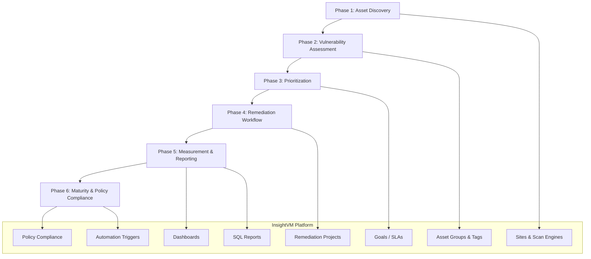
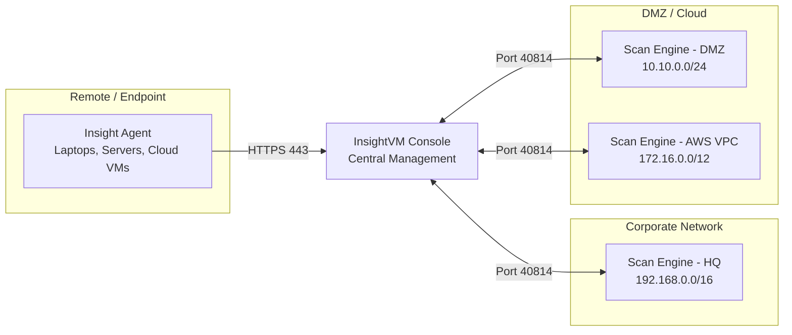

# Design Document: Vulnerability Management Program (InsightVM)

## Overview

This design describes the technical configuration and operational structure of a six-phase Vulnerability Management Program (VMP) built entirely on Rapid7 InsightVM. The program is intentionally scoped to InsightVM's native capabilities — Sites, Scan Engines, Insight Agent, Asset Groups, Tags, Remediation Projects, Goals/SLAs, SQL reports, dashboards, policy compliance scanning, and built-in automation triggers. No external tools, InsightConnect workflows, Remediation Hub, or Surface Command are required.

The program is designed to be executed incrementally. Each phase produces concrete, durable configuration artifacts (Sites, Asset Groups, Tags, dashboards, SQL reports, Goals, runbook entries) that persist and compound as the program matures. A security team of 2–5 analysts can operate this program using InsightVM's web console as the single pane of glass.

### Design Goals

- **Coverage before depth**: Achieve 95% asset scan coverage before optimizing scan fidelity.
- **Risk-driven prioritization**: Use InsightVM's Active Risk Score (CVSS v3 + EPSS + asset criticality + exploit availability) as the canonical sort order.
- **SLA accountability**: Define, configure, and track SLA targets natively in InsightVM Goals so compliance is visible without manual spreadsheet work.
- **Audience-appropriate reporting**: Maintain three distinct dashboard views (executive, operations, remediation) so each stakeholder sees only what they need.
- **Runbook-first maturity**: Every configuration decision is documented in a living runbook so the program survives personnel changes.

### Scope Boundaries

| In Scope | Out of Scope |
|---|---|
| InsightVM Sites, Scan Engines, Insight Agent | InsightConnect, Remediation Hub, Surface Command |
| InsightVM native dashboards and SQL reports | External SIEM, SOAR, or BI tools |
| InsightVM Goals/SLAs and automation triggers | Custom API integrations |
| InsightVM policy compliance scanning | Third-party compliance platforms |
| AWS/Azure/GCP cloud integrations (native InsightVM) | Cloud-native security tools (GuardDuty, Defender, etc.) |

---

## Architecture

### High-Level Program Architecture

The program is structured as a layered configuration model. Each layer depends on the one below it being stable before adding complexity.



### Scan Engine Deployment Model



**Scan Engine placement rules:**
- One Scan Engine per network segment that cannot be reached from the console due to firewall restrictions.
- Scan Engines communicate with the console on TCP 40814 (outbound from engine to console).
- Insight Agent communicates directly to the Insight Platform over HTTPS 443 — no Scan Engine required for agent-assessed assets.
- Cloud integrations (AWS, Azure, GCP) use InsightVM's native cloud connectors; discovered cloud assets are then scanned by a Scan Engine deployed in the same VPC/VNet or assessed by the Insight Agent.

### Site Structure

Sites are the primary unit of scan configuration. The recommended structure organizes Sites by network segment and asset criticality tier to allow independent scan schedules.

```
InsightVM Sites
├── CORP-HQ-Servers          (192.168.1.0/24 – 192.168.10.0/24)
├── CORP-HQ-Workstations     (192.168.50.0/24 – 192.168.60.0/24)
├── CORP-DMZ                 (10.10.0.0/24)
├── CORP-Critical-Assets     (subset: domain controllers, PAM, core infra)
├── CLOUD-AWS-Production     (AWS cloud connector + VPC scan engine)
├── CLOUD-AWS-Dev            (AWS cloud connector + VPC scan engine)
├── CLOUD-Azure-Production   (Azure cloud connector)
├── REMOTE-Endpoints         (Insight Agent only – no IP range)
└── [BU-NAME]-[SEGMENT]      (per business unit, added as scope expands)
```

**Site naming convention:** `{ENVIRONMENT}-{SEGMENT}-{OPTIONAL_QUALIFIER}`
Examples: `CORP-HQ-Servers`, `CLOUD-AWS-Production`, `BU-Finance-Servers`

---

## Components and Interfaces

### Phase 1: Asset Discovery Configuration

#### Scan Engine Deployment Checklist
1. Install Scan Engine on a dedicated host (Windows Server or Linux) within the target network segment.
2. Register the engine with the InsightVM console using the pairing key from **Administration → Engines → Add Engine**.
3. Verify connectivity: console must reach engine on TCP 40814.
4. Assign the engine to the relevant Site(s) in **Site Configuration → Engines**.

#### Insight Agent Deployment
- Deploy via endpoint management tooling (SCCM, Intune, Ansible, Chef, Puppet, or cloud user-data scripts).
- Agent installer available from **Administration → Agents → Download Agent**.
- Agent-assessed assets appear in InsightVM automatically; create a dedicated Site of type "Agent" or use the default **Insight Agent** site.
- Agent provides continuous assessment — no scan schedule required.

#### Cloud Integration Setup
| Cloud | InsightVM Feature | Configuration Path |
|---|---|---|
| AWS | AWS Cloud Integration | Administration → Cloud Configuration → AWS |
| Azure | Azure Cloud Integration | Administration → Cloud Configuration → Azure |
| GCP | GCP Cloud Integration | Administration → Cloud Configuration → GCP |

Cloud integrations enumerate assets via cloud APIs. Discovered assets must still be scanned by a Scan Engine (or assessed by Agent) to produce vulnerability data.

#### Credential Configuration
- Create shared scan credentials in **Administration → Credentials**.
- Credential types: Windows (domain service account), SSH (key-based preferred), SNMP (v3), database (read-only).
- Least-privilege requirements:
  - Windows: Local Administrators group OR WMI/registry read permissions.
  - Linux/Unix: Non-root account with `sudo` access to package manager queries.
- Assign credentials to Sites in **Site Configuration → Authentication**.
- Credential failure is surfaced per-asset in scan results; review via **Assets → Authentication Status** filter.

### Phase 2: Vulnerability Assessment Configuration

#### Scan Templates

InsightVM ships with built-in scan templates. The program uses the following:

| Template | Use Case | Key Settings |
|---|---|---|
| **Full Audit without Web Spider** | Standard credentialed scan for servers and workstations | All checks enabled, web spider disabled |
| **Discovery Scan** | Fast asset enumeration for new ranges | Ping + port scan only, no vulnerability checks |
| **CIS Policy Scan** | Policy compliance assessment (Phase 6) | Policy checks only, no vulnerability checks |
| **DISA STIG Policy Scan** | STIG compliance for government/regulated assets | Policy checks only |
| **Exhaustive** | Deep scan for critical assets (use sparingly) | All checks including web spider |

**Custom scan template for critical assets (7-day cadence):**
- Base: Full Audit without Web Spider
- Throttle: Disabled (scan speed: Maximum)
- Scan timeout: 4 hours
- Name: `VMP-Critical-7Day`

**Custom scan template for standard assets (30-day cadence):**
- Base: Full Audit without Web Spider
- Throttle: Enabled (scan speed: Normal) to reduce network impact
- Scan timeout: 8 hours
- Name: `VMP-Standard-30Day`

#### Scan Schedule Configuration

| Asset Tier | Scan Interval | Template | Scan Window |
|---|---|---|---|
| Very High / High criticality | Every 7 days | VMP-Critical-7Day | Saturday 02:00–06:00 |
| Medium criticality | Every 30 days | VMP-Standard-30Day | Sunday 01:00–09:00 |
| Low / Very Low criticality | Every 30 days | VMP-Standard-30Day | Sunday 01:00–09:00 |
| Cloud assets (agent-assessed) | Continuous | Insight Agent | N/A |
| Policy compliance | Monthly | CIS or DISA STIG | First Sunday of month |

Scan schedules are configured per Site in **Site Configuration → Schedule**.

#### Baseline Recording
- The first completed scan of a new Site automatically becomes the baseline in InsightVM.
- Baselines are visible in **Reports → Baseline Comparison**.
- Document the baseline scan date and result count in the runbook for each Site.

### Phase 3: Prioritization Configuration

#### Asset Criticality Taxonomy

Asset criticality is set per asset or per Asset Group in InsightVM. The following taxonomy maps organizational asset types to InsightVM criticality levels:

| Criticality Level | InsightVM Value | Asset Examples |
|---|---|---|
| Very High | 10 | Domain controllers, PAM systems, core network infrastructure, production databases with PII/PCI data |
| High | 8 | Production application servers, CI/CD systems, identity providers, backup infrastructure |
| Medium | 5 | Development/staging servers, internal web applications, standard workstations |
| Low | 3 | Test environments, non-production cloud instances, printers |
| Very Low | 1 | Decommissioned assets pending removal, isolated lab systems |

Asset criticality is set in **Assets → [Asset] → Edit Criticality** or bulk-assigned via Asset Group in **Asset Groups → [Group] → Set Criticality**.

#### Tagging Taxonomy

Tags are applied to assets to support filtering, scoping, and reporting. The following tag schema is required:

| Tag Category | Tag Values | Purpose |
|---|---|---|
| `env` | `production`, `staging`, `development`, `lab` | Environment scoping |
| `owner` | `{team-name}` (e.g., `infra-ops`, `cloud-eng`, `app-team`) | Remediation ownership routing |
| `data-class` | `pii`, `pci`, `phi`, `internal`, `public` | Data sensitivity for risk weighting |
| `os-type` | `windows-server`, `linux-server`, `workstation`, `network-device`, `cloud-vm` | Scan template and policy selection |
| `bu` | `{business-unit}` (e.g., `finance`, `hr`, `engineering`) | Business unit scoping for dashboards |
| `compliance` | `cis-l1`, `cis-l2`, `disa-stig`, `pci-dss` | Policy compliance scope |

Tags are applied in **Assets → [Asset] → Tags** or bulk-applied via dynamic Asset Group rules.

#### SLA Configuration in InsightVM Goals

InsightVM Goals are configured in **Goals & SLAs → Add Goal**. Create one Goal per severity tier:

| Goal Name | Metric | Target | Scope |
|---|---|---|---|
| `SLA-Critical-15d` | % vulnerabilities remediated within 15 days | ≥ 95% | All assets |
| `SLA-High-30d` | % vulnerabilities remediated within 30 days | ≥ 90% | All assets |
| `SLA-Medium-90d` | % vulnerabilities remediated within 90 days | ≥ 85% | All assets |
| `SLA-Low-180d` | % vulnerabilities remediated within 180 days | ≥ 80% | All assets |

Each Goal surfaces compliance status on the dashboard and triggers an alert when the threshold is breached.

#### Active Risk Score Sort Order

InsightVM's Active Risk Score is the default sort in vulnerability lists. Confirm this in **Vulnerabilities → Sort By → Risk Score (Descending)**. The Active Risk Score formula incorporates:
- CVSS v3 base score
- EPSS score (probability of exploitation within 30 days)
- Asset criticality multiplier
- Known exploit availability (hasExploits flag)

The 1.5x criticality multiplier for Very High assets is applied natively by InsightVM when asset criticality is set to 10.

### Phase 4: Remediation Workflow Configuration

#### Remediation Project Structure

Remediation Projects are created in **Remediation → Projects → Create Project**. The recommended project structure:

| Project Type | Naming Convention | Owner | Due Date Basis |
|---|---|---|---|
| Critical patch sprint | `CRIT-{YYYY-MM}-{DESCRIPTION}` | IT Operations lead | 15 days from detection |
| High monthly patch | `HIGH-{YYYY-MM}-{BU}` | IT Operations / BU owner | 30 days from detection |
| Medium quarterly | `MED-{YYYY-Q#}-{BU}` | IT Operations / BU owner | 90 days from detection |
| Exception tracked | `EXCPT-{YYYY-MM}-{VULN-ID}` | Security team | Exception review date |

Each project must have:
- An assigned owner (required before activation)
- A due date aligned to the SLA tier
- A scope defined by Asset Group or Tag filter

#### Ticketing System Integration

InsightVM supports native integration with Jira and ServiceNow via **Administration → Integrations**. Configuration steps:
1. Navigate to **Administration → Integrations → Ticketing**.
2. Select the ticketing system (Jira or ServiceNow).
3. Provide API credentials and project/queue mapping.
4. Map InsightVM severity levels to ticket priority levels.
5. Enable automatic ticket creation on Remediation Project activation.

For organizations not using Jira or ServiceNow, InsightVM's Remediation Projects serve as the system of record within the platform.

#### Exception Process

Exceptions are recorded in InsightVM as vulnerability exceptions:
1. Navigate to **Vulnerabilities → [Vulnerability] → Add Exception**.
2. Select exception type: **False Positive**, **Compensating Control**, or **Acceptable Risk**.
3. Enter business justification, compensating controls description, and accepted risk date.
4. Set review date ≤ 90 days from approval.
5. Exceptions require approval from the security team lead before taking effect.

Exception tracking report: use the SQL report template in the Data Models section to generate a monthly exception summary.

#### False Positive Handling

False positives are a subtype of vulnerability exception:
1. Navigate to **Vulnerabilities → [Vulnerability] → Add Exception → False Positive**.
2. Document the justification (e.g., "vendor confirmed not applicable to this OS version").
3. Record the approving analyst's name in the comment field.
4. False positives are excluded from vulnerability counts and risk scores after approval.

### Phase 5: Measurement and Reporting Configuration

#### Dashboard Layouts

Three dashboards are configured in **Dashboards → Create Dashboard**:

**Dashboard 1: Executive Risk Overview**

| Card | Type | Configuration |
|---|---|---|
| Risk Score Trend | Line chart | 12-month rolling, all assets |
| SLA Compliance Rate | Gauge | By severity tier, current month |
| Top 10 Highest-Risk Assets | Table | Sorted by Active Risk Score |
| Exploitable Findings Count | KPI card | hasExploits = true OR EPSS > 0.50 |
| Coverage Rate | Gauge | % assets scanned in last 30 days |
| Vulnerability Backlog Trend | Bar chart | 6-month rolling, by severity |

**Dashboard 2: Security Operations Workqueue**

| Card | Type | Configuration |
|---|---|---|
| New Findings (Last 7 Days) | KPI card | First-found timestamp in last 7 days |
| SLA Breach Count | KPI card | Vulnerabilities past SLA, by severity |
| Analyst Workqueue | Table | Open vulns sorted by Active Risk Score |
| Credential Failure Assets | Table | Assets with auth failures in last scan |
| Critical Vulns Awaiting Patch | Table | CVSS ≥ 9.0 AND hasExploits = true |
| Scan Coverage by Site | Table | Last scan date and coverage % per Site |

**Dashboard 3: Remediation Team View**

| Card | Type | Configuration |
|---|---|---|
| Open Remediation Projects | Table | All active projects with due dates |
| Overdue Projects | KPI card | Projects past due date |
| Asset-Level Vulnerability Detail | Table | Filtered by owner tag |
| Patch Compliance by BU | Bar chart | % remediated by business unit |
| Upcoming SLA Deadlines | Table | Vulns expiring in next 14 days |
| Exception Summary | Table | Open exceptions by severity |

#### Automation Triggers (Optional — recommended for Phase 6 maturity)

Automation triggers are optional but recommended. Teams that do not configure triggers should rely on dashboard monitoring and scheduled SQL reports for equivalent visibility. If configured, triggers are set up in **Administration → Automation**:

| Trigger Name | Event | Condition | Action | Recipient | Priority |
|---|---|---|---|---|---|
| `ALERT-Critical-New` | New vulnerability found | CVSS ≥ 9.0 AND hasExploits = true | Email alert | Security team DL | Recommended |
| `ALERT-SLA-Breach` | SLA breach | Vulnerability age > SLA target | Email alert | Asset owner + security team | Recommended |
| `ALERT-Coverage-Drop` | Scan coverage | Coverage < 90% | Email alert | Program administrator | Optional |
| `ALERT-Cred-Failure` | Credential failure | Auth failure on any asset | Email alert | Program administrator | Optional |
| `ALERT-Goal-Breach` | Goal threshold | SLA Goal compliance < target | Email alert | Security team lead | Optional |

If configured, triggers should fire and deliver notifications within 15 minutes of the triggering event. Teams skipping automation triggers should review the Security Operations dashboard and SLA compliance SQL reports on at least a weekly cadence to compensate.

---

## Data Models

### Asset Data Model

Assets in InsightVM carry the following attributes relevant to the VMP:

```
Asset {
  id:               UUID (InsightVM internal)
  hostName:         string
  ip:               string (IPv4/IPv6)
  mac:              string
  osFamily:         string (Windows, Linux, macOS, etc.)
  osProduct:        string
  osVersion:        string
  criticality:      enum { VeryHigh=10, High=8, Medium=5, Low=3, VeryLow=1 }
  riskScore:        float  (Active Risk Score — composite)
  lastScanDate:     timestamp
  firstFoundDate:   timestamp
  sites:            string[]
  assetGroups:      string[]
  tags:             Tag[]
  authStatus:       enum { Success, Failure, NotAttempted }
}

Tag {
  category:  string  (env, owner, data-class, os-type, bu, compliance)
  value:     string
}
```

### Vulnerability Data Model

```
Vulnerability {
  vulnId:               string  (CVE ID or InsightVM internal ID)
  title:                string
  description:          string
  cvssV3Score:          float   (0.0 – 10.0)
  cvssV3Severity:       enum { Critical, High, Medium, Low, Informational }
  epssScore:            float   (0.0 – 1.0)
  hasExploits:          boolean
  riskScore:            float   (Active Risk Score)
  firstFoundTimestamp:  timestamp
  datePublished:        timestamp
  pciCompliant:         boolean
  slaTarget:            int     (calendar days: 15, 30, 90, 180)
  slaBreached:          boolean
  slaBreachDate:        timestamp (firstFoundTimestamp + slaTarget)
  status:               enum { Open, Remediated, Exception, FalsePositive }
  exceptionType:        enum { None, FalsePositive, CompensatingControl, AcceptableRisk }
  exceptionReviewDate:  timestamp
}
```

### Remediation Project Data Model

```
RemediationProject {
  id:           UUID
  name:         string  (follows naming convention)
  owner:        string  (team or individual)
  dueDate:      date    (aligned to SLA tier)
  status:       enum { Draft, Active, Complete, Overdue }
  scope:        AssetGroupRef | TagFilter
  vulnCount:    int
  remediatedCount: int
  createdDate:  date
  severity:     enum { Critical, High, Medium, Low }
}
```

### SLA Goal Data Model

```
Goal {
  name:         string  (e.g., SLA-Critical-15d)
  metric:       string  (% remediated within SLA window)
  target:       float   (e.g., 0.95 for 95%)
  slaWindow:    int     (calendar days)
  severity:     enum { Critical, High, Medium, Low }
  scope:        AssetGroupRef | AllAssets
  currentValue: float   (computed by InsightVM)
  status:       enum { Met, Breached, AtRisk }
}
```

### SQL Report Queries

The following SQL queries are implemented in InsightVM's SQL report console (**Reports → SQL Query Export**):

#### Monthly MTTR by Severity

```sql
SELECT
    dv.severity,
    COUNT(*) AS remediated_count,
    AVG(
        EXTRACT(EPOCH FROM (fa.scan_finished - dv.date_published)) / 86400
    )::int AS avg_days_to_remediate
FROM dim_vulnerability dv
JOIN fact_asset_vulnerability_finding favf ON dv.vulnerability_id = favf.vulnerability_id
JOIN fact_asset fa ON favf.asset_id = fa.asset_id
WHERE favf.status = 'REMEDIATED'
  AND fa.scan_finished >= NOW() - INTERVAL '30 days'
GROUP BY dv.severity
ORDER BY
    CASE dv.severity
        WHEN 'Critical' THEN 1
        WHEN 'High'     THEN 2
        WHEN 'Medium'   THEN 3
        WHEN 'Low'      THEN 4
        ELSE 5
    END;
```

#### SLA Compliance Rate by Severity

```sql
SELECT
    dv.severity,
    COUNT(*) AS total_findings,
    SUM(CASE
        WHEN EXTRACT(EPOCH FROM (NOW() - favf.date_first_found)) / 86400 <=
             CASE dv.severity
                 WHEN 'Critical' THEN 15
                 WHEN 'High'     THEN 30
                 WHEN 'Medium'   THEN 90
                 WHEN 'Low'      THEN 180
                 ELSE 180
             END
        THEN 1 ELSE 0
    END) AS within_sla,
    ROUND(
        100.0 * SUM(CASE
            WHEN EXTRACT(EPOCH FROM (NOW() - favf.date_first_found)) / 86400 <=
                 CASE dv.severity
                     WHEN 'Critical' THEN 15
                     WHEN 'High'     THEN 30
                     WHEN 'Medium'   THEN 90
                     WHEN 'Low'      THEN 180
                     ELSE 180
                 END
            THEN 1 ELSE 0
        END) / NULLIF(COUNT(*), 0), 2
    ) AS sla_compliance_pct
FROM dim_vulnerability dv
JOIN fact_asset_vulnerability_finding favf ON dv.vulnerability_id = favf.vulnerability_id
WHERE favf.status = 'OPEN'
GROUP BY dv.severity
ORDER BY
    CASE dv.severity
        WHEN 'Critical' THEN 1
        WHEN 'High'     THEN 2
        WHEN 'Medium'   THEN 3
        WHEN 'Low'      THEN 4
        ELSE 5
    END;
```

#### Exploitable Findings Summary

```sql
SELECT
    da.host_name,
    da.ip_address,
    dv.title,
    dv.cvss_v3_score,
    dv.severity,
    dv.epss_score,
    favf.date_first_found,
    EXTRACT(EPOCH FROM (NOW() - favf.date_first_found)) / 86400 AS age_days
FROM dim_asset da
JOIN fact_asset_vulnerability_finding favf ON da.asset_id = favf.asset_id
JOIN dim_vulnerability dv ON favf.vulnerability_id = dv.vulnerability_id
WHERE favf.status = 'OPEN'
  AND (dv.exploits > 0 OR dv.epss_score > 0.50)
ORDER BY dv.cvss_v3_score DESC, dv.epss_score DESC
LIMIT 500;
```

#### Open Exception Summary (Monthly)

```sql
SELECT
    da.host_name,
    dv.title,
    dv.severity,
    dve.exception_type,
    dve.reason,
    dve.date_created,
    dve.review_date,
    dve.submitter
FROM dim_asset da
JOIN fact_asset_vulnerability_finding favf ON da.asset_id = favf.asset_id
JOIN dim_vulnerability dv ON favf.vulnerability_id = dv.vulnerability_id
JOIN dim_vulnerability_exception dve ON favf.vulnerability_id = dve.vulnerability_id
WHERE favf.status IN ('EXCEPTION', 'FALSE_POSITIVE')
ORDER BY dve.review_date ASC;
```

#### Scan Coverage Report

```sql
SELECT
    ds.name AS site_name,
    COUNT(DISTINCT da.asset_id) AS total_assets,
    SUM(CASE
        WHEN fa.scan_finished >= NOW() - INTERVAL '30 days' THEN 1 ELSE 0
    END) AS scanned_last_30d,
    ROUND(
        100.0 * SUM(CASE
            WHEN fa.scan_finished >= NOW() - INTERVAL '30 days' THEN 1 ELSE 0
        END) / NULLIF(COUNT(DISTINCT da.asset_id), 0), 2
    ) AS coverage_pct
FROM dim_site ds
JOIN dim_asset_site das ON ds.site_id = das.site_id
JOIN dim_asset da ON das.asset_id = da.asset_id
LEFT JOIN fact_asset fa ON da.asset_id = fa.asset_id
GROUP BY ds.name
ORDER BY coverage_pct ASC;
```

### Policy Compliance Data Model (Phase 6)

```
PolicyComplianceResult {
  assetId:          UUID
  hostName:         string
  benchmarkId:      string  (e.g., CIS_Ubuntu_20.04_L1)
  profileId:        string  (e.g., Level 1 - Server)
  ruleId:           string
  ruleTitle:        string
  status:           enum { Pass, Fail, NotApplicable, Error }
  proof:            string  (evidence text)
  lastAssessed:     timestamp
}
```

### Maturity Model Data Model

```
MaturityAssessment {
  assessmentDate:   date
  level:            enum { Initial=1, Developing=2, Defined=3, Optimizing=4 }
  phaseScores: {
    assetDiscovery:       int  (1–4)
    vulnAssessment:       int  (1–4)
    prioritization:       int  (1–4)
    remediationWorkflow:  int  (1–4)
    measurement:          int  (1–4)
    maturity:             int  (1–4)
  }
  gaps:             string[]
  actionItems:      string[]
  assessedBy:       string
}
```

---

## Correctness Properties

*A property is a characteristic or behavior that should hold true across all valid executions of a system — essentially, a formal statement about what the system should do. Properties serve as the bridge between human-readable specifications and machine-verifiable correctness guarantees.*


### Property 1: Risk Score Ordering Reflects Input Factors

*For any* two vulnerabilities on two assets where one has a strictly higher CVSS v3 score, higher EPSS score, and higher asset criticality than the other, the Active Risk Score of the first vulnerability-asset pair SHALL be greater than the Active Risk Score of the second pair.

**Validates: Requirements 3.1**

### Property 2: Critical Classification for High-CVSS Exploitable Vulnerabilities

*For any* vulnerability where CVSS v3 score ≥ 9.0 AND hasExploits is true, the vulnerability's severity classification SHALL be Critical, regardless of the criticality level of the asset it affects.

**Validates: Requirements 3.2**

### Property 3: EPSS Escalation Rule

*For any* vulnerability where EPSS score > 0.70, the effective priority tier assigned by the program SHALL be one level higher than the tier that the CVSS v3 base score alone would produce (e.g., a High-CVSS vulnerability with EPSS > 0.70 must be treated as Critical priority).

**Validates: Requirements 3.3**

### Property 4: SLA Breach Flag Consistency

*For any* open vulnerability (status = Open, not Exception or FalsePositive) where the elapsed time since first-found timestamp exceeds the SLA target for its severity tier (Critical=15d, High=30d, Medium=90d, Low=180d), the vulnerability SHALL be flagged as an SLA breach in reporting.

**Validates: Requirements 3.5**

### Property 5: Very High Criticality Risk Multiplier

*For any* vulnerability present on both a Very High criticality asset and a Medium criticality asset, the risk score contribution of the Very High asset SHALL be approximately 1.5× greater than the risk score contribution of the Medium criticality asset, all other factors being equal.

**Validates: Requirements 3.7**

### Property 6: Active Remediation Projects Must Have Owners

*For any* Remediation Project in Active status, the project owner field SHALL be non-null and non-empty. No project may transition to Active status without an assigned owner.

**Validates: Requirements 4.2**

### Property 7: Exception Data Completeness

*For any* approved vulnerability exception (including false positives), the record SHALL contain: a non-null business justification, a non-null compensating controls description or false-positive rationale, a non-null accepted risk date or false-positive approval date, and the name of the approving analyst. No exception may be approved with any of these fields missing.

**Validates: Requirements 4.7, 4.10**

### Property 8: Exception Review Date Constraint

*For any* approved vulnerability exception, the review date SHALL be no more than 90 calendar days after the approval date. An exception with a review date more than 90 days in the future from its approval date is invalid.

**Validates: Requirements 4.8**

### Property 9: Exploitable Findings Query Correctness

*For any* vulnerability returned by the exploitable findings report query, the vulnerability SHALL satisfy at least one of the following conditions: hasExploits = true OR epss_score > 0.50. No vulnerability that fails both conditions may appear in the exploitable findings metric.

**Validates: Requirements 5.8**

### Property 10: Runbook Structural Completeness

*For any* version of the program runbook document, it SHALL contain dedicated sections covering all of the following configuration artifact types: scan configurations, Asset Groups, Tags, Remediation Project templates, Goals/SLA definitions, dashboard layouts, and SQL report definitions. A runbook missing any of these sections is incomplete.

**Validates: Requirements 6.9**

---

## Error Handling

### Scan Engine Connectivity Loss

**Condition:** Scan Engine loses connectivity to the InsightVM console.
**Behavior:** InsightVM Scan Engine queues scan results locally in its local database. Upon reconnection, results are transmitted to the console automatically.
**Detection:** Console shows engine status as "Offline" in **Administration → Engines**. If automation triggers are configured, set up a trigger on engine status change for proactive alerting.
**Recovery:** No manual intervention required for result transmission. Investigate network/firewall cause of connectivity loss.

### Credential Failure on Scan

**Condition:** Credentialed scan fails to authenticate to one or more assets.
**Behavior:** InsightVM records the authentication failure per asset. Vulnerability results for that asset are unauthenticated (lower fidelity — may miss software-level vulnerabilities).
**Detection:** Filter **Assets → Authentication Status = Failed** after each scan. If automation triggers are configured, `ALERT-Cred-Failure` can fire on any credential failure.
**Recovery:** Program Administrator investigates and resolves credential issue within 5 business days (Requirement 2.9). Common causes: password rotation, account lockout, firewall blocking WMI/SSH ports.

### SLA Breach

**Condition:** A vulnerability's age exceeds its SLA target without remediation or approved exception.
**Behavior:** InsightVM Goal `SLA-{Severity}-{Days}` shows compliance rate below target. If automation triggers are configured, `ALERT-SLA-Breach` fires and notifies asset owners.wner and security team.
**Detection:** SLA breach count KPI card on Security Operations dashboard. Monthly SLA compliance SQL report.
**Recovery:** Escalate to remediation team owner. If remediation is not feasible within SLA, initiate formal exception process (Requirement 4.7).

### Scan Coverage Drop Below 90%

**Condition:** Monthly scan coverage falls below 90% of in-scope assets.
**Behavior:** Automation trigger `ALERT-Coverage-Drop` fires if configured. Coverage gauge on Executive dashboard turns red.
**Detection:** Scan Coverage SQL report. Coverage gauge on all three dashboards.
**Recovery:** Program Administrator identifies gap assets (stale assets, unreachable segments, missing Scan Engines) and presents remediation plan to security leadership within 5 business days (Requirement 5.5).

### Goal Threshold Breach

**Condition:** An InsightVM Goal's compliance metric falls below its configured target threshold.
**Behavior:** Goal status changes to "Breached" in **Goals & SLAs**. Dashboard card for the Goal turns red. Automation trigger `ALERT-Goal-Breach` fires if configured.
**Detection:** Goals & SLAs dashboard section. Executive dashboard SLA compliance gauges.
**Recovery:** Security team reviews root cause. If risk score trend increased ≥ 10%, written root cause analysis required within 10 business days (Requirement 5.3).

### Exception Review Date Expiry

**Condition:** An approved exception's review date passes without renewal or remediation.
**Behavior:** Exception appears in the Open Exception Summary SQL report with a past review date. No automatic platform enforcement — requires manual review process.
**Detection:** Open Exception Summary SQL report (monthly). Filter: `review_date < CURRENT_DATE`.
**Recovery:** Security team reviews expired exceptions. Either renew with updated justification (new 90-day review date) or escalate for remediation.

### Cloud Integration Sync Failure

**Condition:** AWS/Azure/GCP cloud integration fails to enumerate assets.
**Behavior:** Cloud-native assets are not updated in InsightVM. Coverage reporting may show stale cloud asset data.
**Detection:** **Administration → Cloud Configuration** shows integration error status.
**Recovery:** Verify cloud API credentials and permissions. Re-authenticate integration. Check cloud provider API availability.

---

## Testing Strategy

### Overview

This program is primarily an operational configuration and process design, not a software application with pure functions. The majority of acceptance criteria describe platform behavior (InsightVM), configuration requirements, and human process steps — none of which are suitable for property-based testing. However, a subset of the requirements describe logical rules (prioritization logic, SLA calculations, exception data constraints, query correctness) that can and should be verified with automated tests.

### PBT Applicability Assessment

Property-based testing IS applicable to this feature for the following components:
- **Prioritization logic**: The multi-factor risk scoring rules (Properties 1–5) describe universal mathematical/logical properties that hold for all valid inputs.
- **Remediation workflow constraints**: Owner assignment and exception data completeness rules (Properties 6–8) are invariants that must hold for all records.
- **Query correctness**: The exploitable findings filter (Property 9) is a pure predicate that must hold for all returned rows.
- **Runbook structure**: The completeness constraint (Property 10) is a structural invariant.

PBT is NOT applicable to:
- InsightVM platform behavior (scan engine queuing, baseline recording, auth status reporting) — use integration tests.
- Configuration requirements (Sites, Scan Engines, Goals, dashboards) — use smoke tests / configuration audits.
- Human process steps (5-day SLA for credential fix, annual policy review) — use process audits.

### Property-Based Testing

**Library:** [Hypothesis](https://hypothesis.readthedocs.io/) (Python) for SQL query logic and data model validation. If the program includes TypeScript/JavaScript tooling, use [fast-check](https://fast-check.dev/).

**Minimum iterations:** 100 per property test.

**Tag format:** `# Feature: vuln-management-program, Property {N}: {property_text}`

| Property | Test Description | Generator Strategy |
|---|---|---|
| Property 1 | Risk score ordering | Generate pairs of (vulnerability, asset) with varying CVSS/EPSS/criticality; verify ordering |
| Property 2 | Critical classification | Generate vulnerabilities with CVSS ≥ 9.0 AND hasExploits=true; verify all classified Critical |
| Property 3 | EPSS escalation | Generate vulnerabilities with EPSS > 0.70; verify effective tier is one above CVSS base tier |
| Property 4 | SLA breach flag | Generate open vulnerabilities with age > SLA target; verify all flagged as breached |
| Property 5 | 1.5x criticality multiplier | Generate same vulnerability on Very High vs Medium asset; verify 1.5x ratio |
| Property 6 | Active project owner | Generate active Remediation Projects; verify owner field non-null |
| Property 7 | Exception completeness | Generate approved exceptions; verify all required fields non-null |
| Property 8 | Exception review date | Generate approved exceptions; verify review_date ≤ approval_date + 90 days |
| Property 9 | Exploitable findings filter | Generate vulnerability sets; verify query returns only hasExploits=true OR EPSS>0.50 |
| Property 10 | Runbook completeness | Generate runbook documents; verify all required sections present |

### Unit / Example-Based Tests

Unit tests cover specific scenarios and edge cases not addressed by property tests:

- **SLA boundary conditions**: Verify a vulnerability at exactly day 15 (Critical) is not yet breached; at day 16 it is.
- **EPSS threshold boundary**: Verify EPSS = 0.70 does NOT trigger escalation; EPSS = 0.701 does.
- **CVSS threshold boundary**: Verify CVSS = 8.9 does not auto-classify as Critical; CVSS = 9.0 does.
- **Exception SQL query**: Verify the Open Exception Summary query returns correct columns and grouping.
- **Coverage SQL query**: Verify the Scan Coverage query returns correct percentage calculation.
- **MTTR SQL query**: Verify the MTTR query correctly calculates average days for a known dataset.

### Integration Tests

Integration tests verify InsightVM platform behavior with 1–3 representative examples:

- **Stale asset flagging**: Verify assets not scanned in 30+ days appear in coverage gap reports.
- **Baseline recording**: Verify first scan of a new Site creates a baseline record.
- **Auth status reporting**: Verify credential failure is reported per-asset after a failed credentialed scan.
- **Goal breach surfacing**: Verify Goal breach appears in dashboard when compliance drops below target.
- **Automation trigger delivery** *(if configured)*: Verify notification is delivered within 15 minutes of trigger event.
- **Policy compliance reporting**: Verify pass/fail results are reported per rule and per asset after policy scan.

### Smoke Tests / Configuration Audits

Smoke tests verify the program is correctly configured before each phase is declared complete:

- **Phase 1 complete**: At least one Site per network segment; Scan Engines registered; Agent deployed to managed endpoints; cloud integrations configured; credentials assigned.
- **Phase 2 complete**: Scan schedules configured for all Sites; asset criticality assigned to all assets; Asset Groups and Tags applied; 12-month history retention confirmed.
- **Phase 3 complete**: SLA Goals configured for all four severity tiers; Active Risk Score is default sort; prioritization policy documented.
- **Phase 4 complete**: Remediation Project templates created; ticketing integration configured; exception process documented; patching cadence policy published.
- **Phase 5 complete**: Three dashboards configured; all five core metric SQL reports created; monthly reporting cadence established.
- **Phase 6 complete**: Policy compliance scans configured for all asset classes; automation triggers configured if adopted (optional); maturity model documented; runbook complete.

### Monthly Metric Validation

Each month, the following SQL reports are run and results are validated:
1. MTTR by Severity — verify non-null results for each severity tier.
2. SLA Compliance Rate — verify percentages are between 0 and 100.
3. Exploitable Findings Summary — verify all returned rows satisfy hasExploits=true OR EPSS>0.50.
4. Open Exception Summary — verify review dates are not more than 90 days past approval dates.
5. Scan Coverage Report — verify total coverage ≥ 95% across all Sites.
